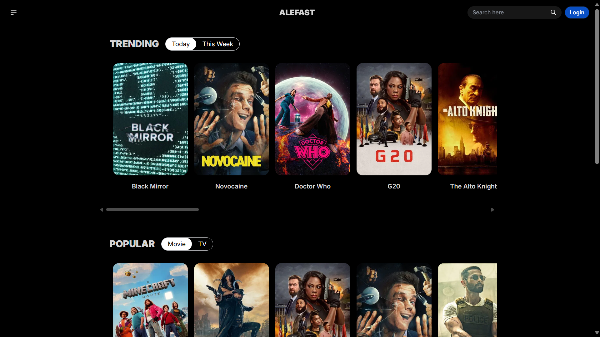
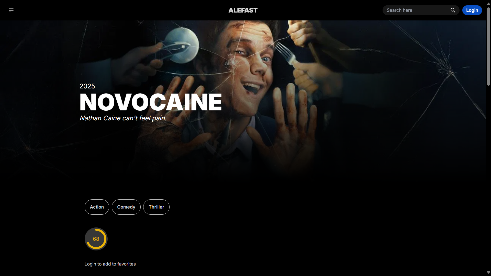
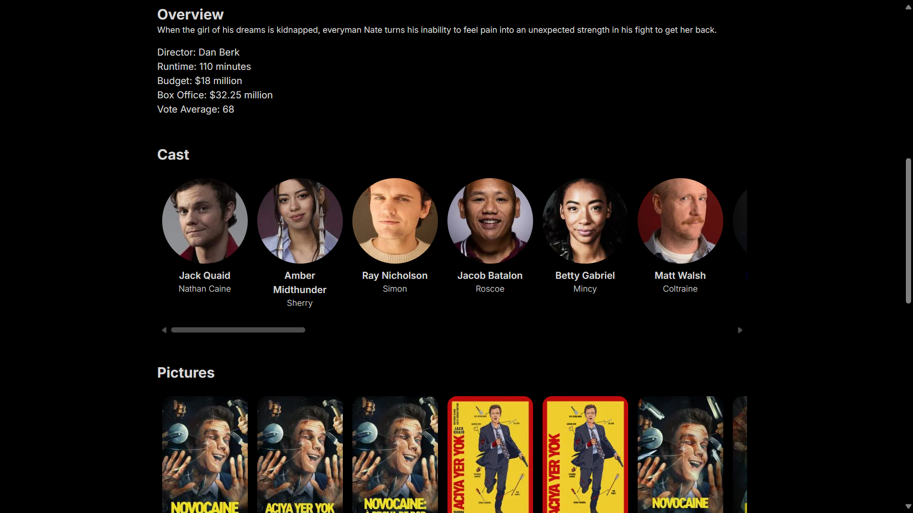

# NEXT MOVIE APP

Your one stop place for all your movies and tv shows. Get info about the current popular, trending, and now playing movies & tv.

## Screenshot





## Features

1. Get Info about the current popular, trending, and now playing movies & tv.
2. Get detailed info about the movies or tv show.
3. Search for all available movies or tv shows
4. Add movies or tv shows to your favorite list
5. Add comments to your favorite movies or tv shows

## Tech Stack

1. [The Movie DB API](https://developer.themoviedb.org/reference/intro/getting-started)
2. [NextJS](https://nextjs.org) - Reactjs Meta Framework
3. [Tailwind CSS](https://tailwindcss.com/) - UI Library
4. [Daisy UI](https://daisyui.com/) - UI Component Library
5. [Vercel](https://vercel.com) - CI/CD

## Getting Started

First, run the development server:

```bash
npm run dev
# or
yarn dev
```

Open [http://localhost:3000](http://localhost:3000) with your browser to see the result.

You can start editing the page by modifying `pages/index.js`. The page auto-updates as you edit the file.

[API routes](https://nextjs.org/docs/api-routes/introduction) can be accessed on [http://localhost:3000/api/hello](http://localhost:3000/api/hello). This endpoint can be edited in `pages/api/hello.js`.

The `pages/api` directory is mapped to `/api/*`. Files in this directory are treated as [API routes](https://nextjs.org/docs/api-routes/introduction) instead of React pages.
